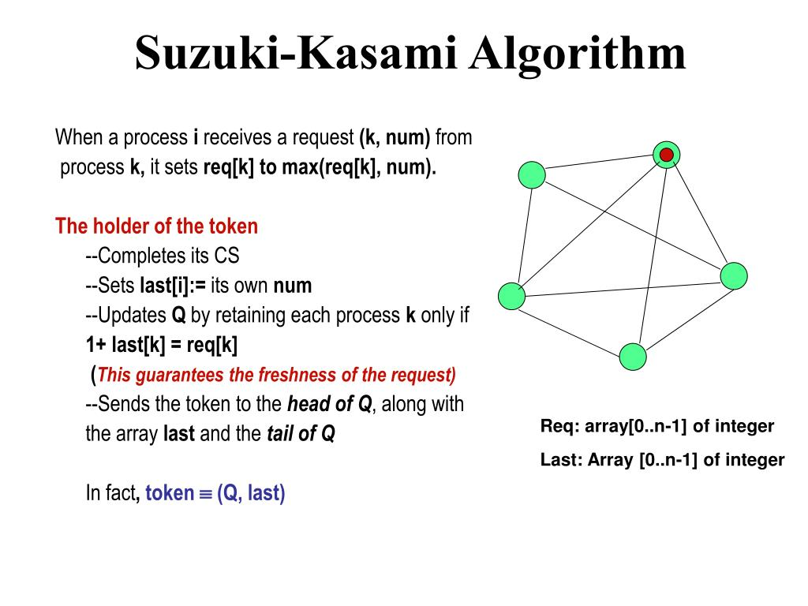

# Livraison et Production Distribuées avec RMI et Suzuki-Kasami



This project implements a **distributed system** for managing delivery and production using **Java RMI**. It is based on the **Suzuki-Kasami token algorithm** to ensure **distributed mutual exclusion**.

A single token circulates among the nodes, allowing exclusive access to shared resources and coordinating operations efficiently. The system demonstrates **synchronization and resource management** in a distributed environment, handling multiple nodes for production and delivery tasks.

## Features

* Distributed management of delivery and production tasks
* Token-based mutual exclusion using Suzuki-Kasami algorithm
* Coordination of multiple nodes in a distributed system
* Implementation in Java with RMI for remote communication

## Requirements

* Java JDK 11 or higher
* IDE or terminal for compiling and running Java RMI programs

## How to Run

1. Compile the source code:

```bash
javac -d bin src/**/*.java
```

2. Start the server:

```bash
java -cp bin server.StockServer
```

3. Start clients as needed, connecting to the RMI registry.

---

This project is intended for learning and demonstrating **distributed system concepts** and **mutual exclusion algorithms**.


